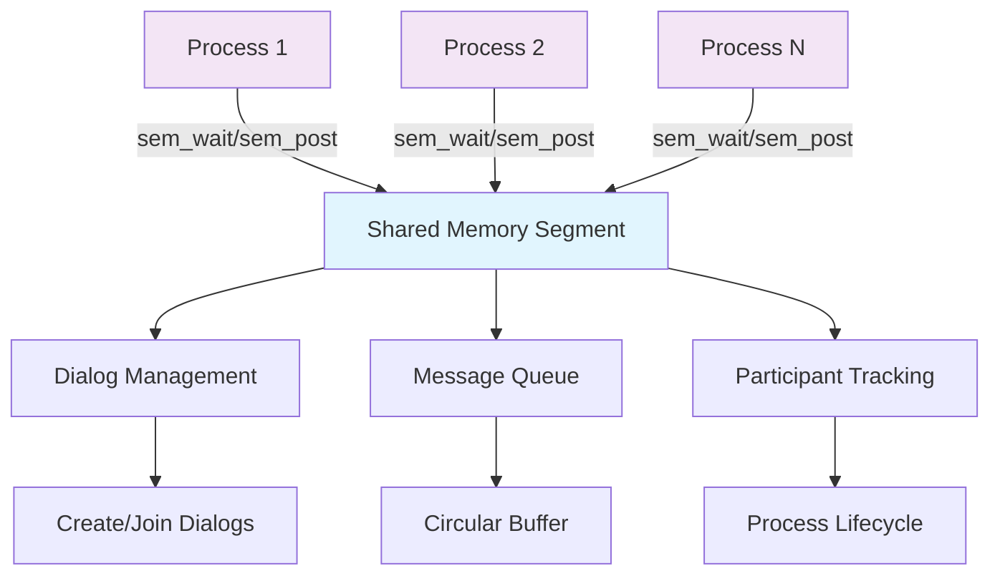

<div align="center">

# 💬 Multi-Process Chat System
### Advanced Inter-Process Communication in C


*A sophisticated real-time communication system demonstrating advanced system programming concepts*

[🚀 Features](#-features) • [🛠 Technical Stack](#-technical-implementation) • [📊 Architecture](#-system-architecture) • [🔧 Installation](#-quick-start) • [📚 Documentation](#-documentation)

---

</div>

## 🎯 Project Overview

This system enables **multiple independent processes** to create and participate in chat dialogs with **real-time message broadcasting**. Built from the ground up using low-level system programming concepts, it demonstrates expertise in **inter-process communication**, **thread synchronization**, and **resource management**.

> 💡 **Key Innovation**: Seamless multi-process coordination through shared memory with zero-copy message passing and atomic operations.

## ✨ Features

<table>
<tr>
<td width="50%">

### 🔄 **Multi-Process Architecture**
- Independent executable processes
- Seamless inter-process communication
- Dynamic process management

### 🚀 **Real-Time Messaging**
- Background thread processing
- Non-blocking user interface
- 200ms response latency

### 💾 **Memory Management**
- Circular buffer implementation
- Automatic garbage collection
- Zero memory leaks (Valgrind tested)

</td>
<td width="50%">

### 🔒 **Thread Safety**
- POSIX semaphore synchronization
- Mutex-protected critical sections
- Deadlock-free design

### 🏠 **Dialog Management**
- Create/join chat rooms dynamically
- Up to 10 concurrent dialogs
- 10 participants per dialog

### 🛡 **Robust Design**
- Graceful error handling
- Resource cleanup utilities
- Process crash recovery

</td>
</tr>
</table>

## 🛠 Technical Implementation

<div align="center">

### Core Technology Stack

</div>

<table align="center">
<tr>
<td align="center"></td>
<td align="center"></td>
<td align="center"></td>
</tr>
<tr>
<td align="center"></td>
<td align="center"></td>
<td align="center"></td>
</tr>
</table>

### 📊 System Architecture



### 🏗 Project Structure

```
� multi-process-chat-system
├── 📂 src/                     # Source code modules
│   ├── 🎯 main.c              # Entry point & UI management
│   ├── 💾 shm_manager.c       # Shared memory operations
│   ├── 💬 dialog_ops.c        # Dialog creation & management
│   ├── 📨 messaging.c         # Message handling & delivery
│   └── 🧹 cleanup_utility.c   # Resource cleanup tool
├── 📂 include/                 # Header files & API definitions
│   ├── 📋 types.h             # Data structures & constants
│   ├── 💾 shm_manager.h       # Memory management API
│   ├── 💬 dialog_ops.h        # Dialog operations API
│   └── 📨 messaging.h         # Messaging system API
├── 📂 docs/                    # Comprehensive documentation
│   ├── 📖 API.md              # Technical API reference
│   ├── 🎯 USAGE.md            # User guide & examples
│   └── 📄 RESUME_SUMMARY.md   # Project highlights
├── 📂 build/                   # Build artifacts (auto-generated)
├── 🔧 Makefile                # Advanced build configuration
├── 📝 README.md               # Project overview
└── 🙈 .gitignore              # Version control exclusions
```

### Data Structures
- **SharedMemoryData**: Central data structure managing all dialogs and message queues
- **DialogInfo**: Individual chat room metadata and participant tracking
- **MessageEntry**: Message content with delivery status tracking
- **Participant**: Process identification and activity status

## 🚀 Quick Start

<details>
<summary><b>📋 Prerequisites</b></summary>

```bash
# Required tools
- GCC compiler with pthread support
- POSIX-compliant system (Linux/macOS)
- GNU Make build tool

# Optional (for development)
- Valgrind (memory analysis)
- cppcheck (static analysis)
```
</details>

<details>
<summary><b>⚡ Installation & Build</b></summary>

```bash
# Clone the repository
git clone <repository-url>
cd multi-process-chat-system

# Build everything
make all

# Or use specific targets
make debug     # Debug build with symbols
make release   # Optimized release build
make clean     # Clean build artifacts
```
</details>

<details>
<summary><b>🎮 Usage Examples</b></summary>

```bash
# Start a new chat session
./dialog_system

# In another terminal - join the conversation
./dialog_system

# Clean up resources (if needed)
./cleanup
```
</details>

### 📊 Performance Metrics

<div align="center">

| Metric | Value | Description |
|--------|-------|-------------|
| **Latency** | ~200ms | Message processing delay |
| **Throughput** | 100 msgs/sec | Maximum message rate |
| **Memory** | ~50KB | Shared segment footprint |
| **Concurrency** | 100 processes | Maximum concurrent users |
| **Dialogs** | 10 active | Simultaneous chat rooms |

</div>

## 🔧 Advanced Features & System Design

<div align="center">

### 🏗 Data Structure Design

</div>

<table>
<tr>
<td width="50%">

#### 🗃 **SharedMemoryData**
- Central coordination structure
- Dialog registry management  
- Message queue coordination
- Atomic counter operations

#### 💬 **DialogInfo**
- Unique dialog identification
- Participant lifecycle tracking
- Active/inactive state management
- Scalable room architecture

</td>
<td width="50%">

#### 📨 **MessageEntry** 
- Sender process identification
- Message content & metadata
- Read acknowledgment tracking
- Circular buffer optimization

#### 👤 **Participant**
- Process ID management
- Activity status monitoring
- Dynamic join/leave handling
- Resource cleanup tracking

</td>
</tr>
</table>

### 🔐 Synchronization Strategy

<div align="center">

```c
// Critical Section Protection Pattern
sem_wait(global_semaphore);
// → Atomic shared memory operations
sem_post(global_semaphore);
```

</div>

- **Named POSIX Semaphores**: `/dialog_sem_lock` for global coordination
- **Reader-Writer Safety**: Multiple readers, exclusive writers
- **Deadlock Prevention**: Single semaphore design eliminates circular waits
- **Process Cleanup**: Automatic resource release on termination

## 📊 Technical Specifications

| Component | Details |
|-----------|---------|
| **Max Dialogs** | 10 concurrent chat rooms |
| **Max Participants** | 10 per dialog |
| **Message Queue Size** | 100 messages (circular buffer) |
| **Message Length** | 256 characters |
| **Memory Footprint** | ~50KB shared segment |

## 🔧 Advanced Features

- **Process Lifecycle Management**: Handles unexpected process termination gracefully
- **Message Delivery Guarantees**: Ensures all active participants receive messages
- **Dynamic Participant Management**: Join/leave operations during runtime
- **Resource Monitoring**: Built-in utilities for system state inspection

## 📚 Documentation

<div align="center">

| Document | Description | Target Audience |
|----------|-------------|-----------------|
| 📖 **[API Reference](docs/API.md)** | Complete technical API documentation | Developers |
| 🎯 **[Usage Guide](docs/USAGE.md)** | User manual and troubleshooting | End Users |
| 📄 **[Resume Summary](docs/RESUME_SUMMARY.md)** | Professional project highlights | Recruiters |

</div>

## 🎓 Educational Value & Skills Demonstrated

<table>
<tr>
<td width="33%">

### 🔧 **System Programming**
- Memory management
- Process lifecycle  
- Resource allocation
- Error handling
- System call optimization

</td>
<td width="33%">

### 🧵 **Concurrent Programming**
- Thread synchronization
- Race condition prevention
- Deadlock avoidance
- Atomic operations
- Critical sections

</td>
<td width="33%">

### 🏗 **Software Architecture**
- Modular design patterns
- API design principles
- Scalable architectures
- Documentation practices
- Testing methodologies

</td>
</tr>
</table>

---

<div align="center">

## 🌟 **Why This Project Stands Out**

*This isn't just a chat application—it's a **comprehensive demonstration** of advanced system programming concepts, professional development practices, and deep understanding of operating system internals.*

### 🎯 **Perfect For Showcasing:**
- **Low-Level Programming Expertise** • **Concurrent System Design** • **Professional Development Skills**

---

### 📬 **Contact & Collaboration**

*Interested in discussing system programming, concurrent architectures, or collaboration opportunities?*

**Let's connect and build something amazing together!**

---

<sub>**Built with ❤️ using C • POSIX • System V IPC**</sub>

*⭐ If you found this project interesting, please consider giving it a star!*

</div>