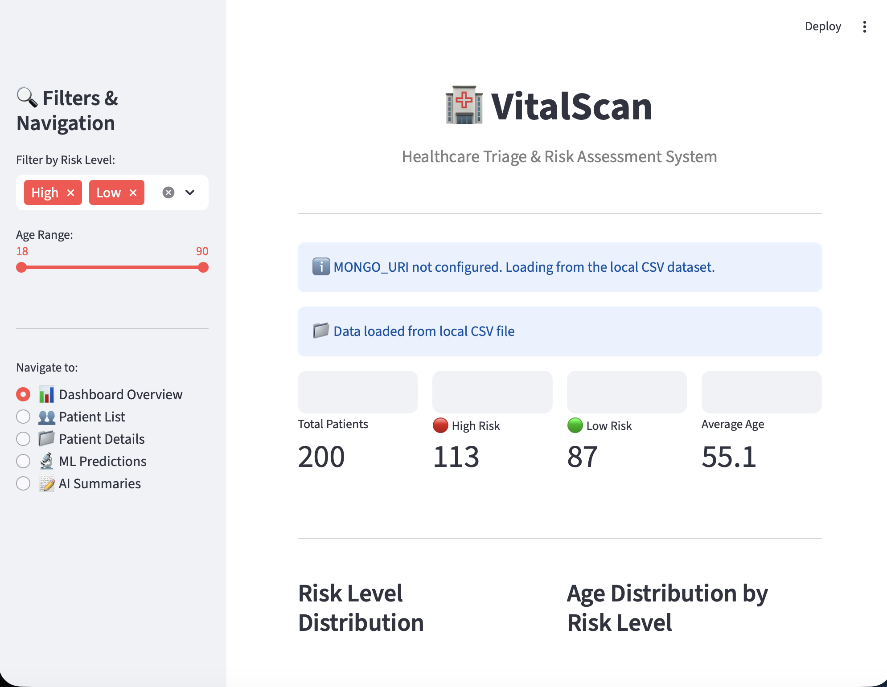
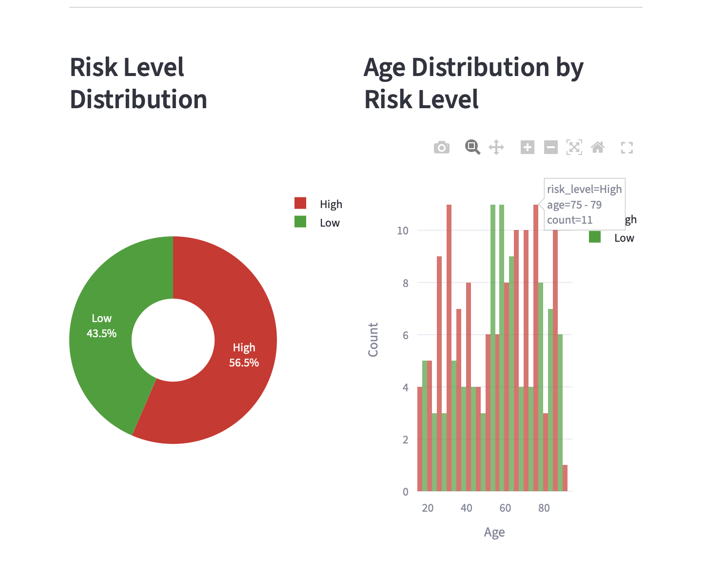
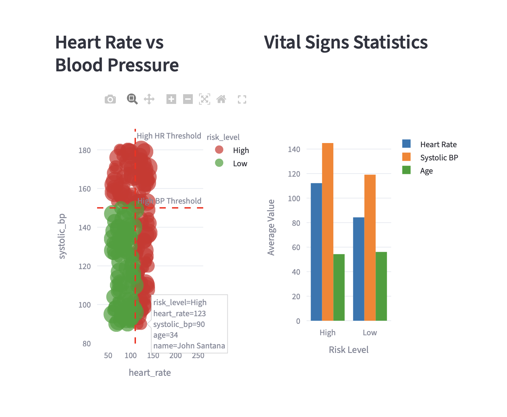

# MediSynth AI

MediSynth AI is a small healthcare data project I built to bring a few different ideas into one place: synthetic patient data, a simple machine learning model, note summarization, and an interactive dashboard.

The idea was to create something that feels close to a real triage workflow without using any real patient information. Everything in this project is synthetic, but the structure is similar to the kind of pipeline you would build for an analytics or decision-support tool.

## Why I built this

I wanted one project that showed more than just model training.

Most machine learning demos stop at a notebook or a single script. For this one, I wanted to go a bit further and build the full flow:
- generate a dataset
- store it in a database
- train a prediction model
- create short note summaries
- surface everything in a dashboard

It gave me a chance to work across data engineering, machine learning, and product-facing UI in one repository.

## What the project does

At a high level, the project simulates a hospital triage workflow.

### Main parts

**1. Synthetic patient data generation**  
The generator creates patient records with names, age, vital signs, room numbers, blood types, admission dates, and short medical notes.

**2. Risk prediction**  
A Random Forest model predicts whether a patient falls into a high-risk or low-risk category using a few simple clinical features:
- age
- heart rate
- systolic blood pressure

**3. Note summarization**  
The summarization step turns longer medical notes into shorter clinical summaries and extracts likely medications. In this version, that flow runs in demo mode so the project stays easy to run locally.

**4. Streamlit dashboard**  
The app brings everything together in one interface so you can browse patients, inspect vitals, check predictions, and view summaries.

## Screenshots

### Dashboard overview


### Patient details view


### Prediction and summary flow


## Tech stack

- Python
- Pandas
- NumPy
- Scikit-learn
- MongoDB / PyMongo
- Streamlit
- Plotly
- Faker

## Project structure

```text
Hospital Project/
├── app.py
├── requirements.txt
├── data/
│   └── patients_data.csv
├── assets/
│   └── screenshots/
├── models/
├── scripts/
│   ├── generate_data.py
│   ├── upload_to_mongo.py
│   ├── train_model.py
│   └── ai_summarizer.py
└── README.md
```

## Running the project locally

### 1. Install dependencies

```bash
pip install -r requirements.txt
```

### 2. Create a local environment file

Copy `.env.example` to `.env` and add your values if you want to use MongoDB.

```env
MONGO_URI=your_mongodb_connection_string
OPENAI_API_KEY=
```

If you leave `MONGO_URI` empty, the project still works with the local CSV file.

### 3. Generate the patient dataset

```bash
python scripts/generate_data.py
```

### 4. Upload records to MongoDB (optional)

```bash
python scripts/upload_to_mongo.py
```

### 5. Train the model

```bash
python scripts/train_model.py
```

### 6. Generate note summaries

```bash
python scripts/ai_summarizer.py
```

### 7. Start the dashboard

```bash
streamlit run app.py
```

By default, Streamlit should open the app at:

```text
http://localhost:8501
```

## What I’d highlight about this project

A few things I like about this build:
- it works as a complete pipeline instead of a single isolated script
- it has a clean fallback path when a cloud database is not configured
- it mixes data work with an actual interface someone can use
- it is easy to extend with new model features, API endpoints, or deployment steps

## Things I would improve next

If I keep building on this project, the next things I’d add are:
- unit tests for the scripts
- model evaluation logging
- a deployed dashboard version
- better patient search and filtering
- a small API layer for predictions

## Notes

- All patient data in this repository is synthetic.
- This project is for demonstration and portfolio use.
- It is not intended for real clinical decision-making.
