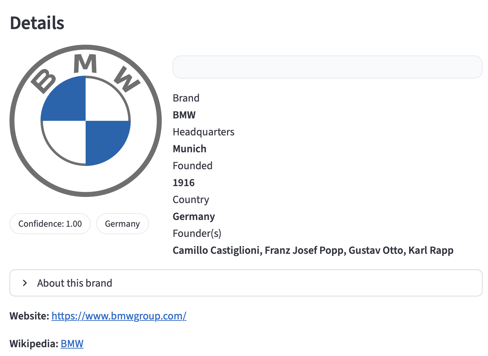

# 🚗 Car Brand Identifier (Gemini + Streamlit)

[](https://carrecognitionproject.streamlit.app)

Identify car **brands** from photos or logos using **Google's Gemini 2.0 Flash (Experimental) LLM**.  
Upload an image → get the brand name, confidence score, and enriched details such as **headquarters, founding year, parent company, founders, country, website,** and a **Wikipedia summary** — all in a clean, interactive UI.

---

## ✨ Features

- 🔎 **Car brand recognition** from logos and car photos  
- 📊 **Confidence score** with model rationale  
- 🌍 **Live enrichment** using Wikidata/Wikipedia (HQ, founded, parent company, country, website, summary)  
- ⚡ **Caching** for faster repeated lookups  
- 🎨 Simple, responsive UI built with **Streamlit**

---

## 🧠 How It Works

1. **Upload** a car logo or photo.  
2. The app sends the image to **Gemini 2.0 Flash Experimental** with a structured JSON prompt.  
3. Gemini responds with a prediction, e.g.:  
   ```json
   {
     "brand": "BMW",
     "confidence": 0.95,
     "rationale": "Recognized the blue-white roundel logo"
   }
   ```  
4. The app **enriches** the result with Wikidata & Wikipedia details.  
5. The output is displayed as an interactive **brand card**.

---

## 🛠️ Tech Stack

- **Python 3.11+**  
- **Streamlit** → frontend & app framework  
- **Google Gemini 2.0 API** (`google-generativeai` - currently deprecated, transitioning to `google-genai`)  
- **Pillow** → image handling  
- **Pydantic** → model validation  
- **Requests** → API calls (Wikidata, Wikipedia)  
- **python-dotenv** → environment variable management

---

## 📂 Project Structure

```
car-brand-app/
├── app.py             # Main Streamlit app
├── requirements.txt   # Dependencies
├── .env               # Local environment variables (not committed)
└── test_images/       # Example logos for testing
```

---

## 🚀 Live Demo

👉 Try it instantly here:  
**[carrecognitionproject.streamlit.app](https://carrecognitionproject.streamlit.app)**

---

## 💻 Run Locally

Clone and set up the project:

```bash
git clone https://github.com/limpakis/my-projects.git
cd my-projects/car-brand-app

# Create & activate a virtual environment (macOS/Linux)
python3 -m venv .venv
source .venv/bin/activate

# Install dependencies
pip install -r requirements.txt

# Add your Gemini API key in a .env file
echo "GOOGLE_API_KEY=your_api_key_here" > .env

# Run the app
streamlit run app.py
```

On **Streamlit Cloud**, secrets are managed in  
**Settings → Secrets → GOOGLE_API_KEY**.

---

## 📸 Example



---

## 🧭 Roadmap

- ✅ Brand recognition with Gemini  
- ✅ Wikipedia/Wikidata enrichment  
- ⏳ Add batch processing (ZIP → CSV)  
- ⏳ Support for top-K predictions  
- ⏳ Multilingual support (EN/GR)

---

## 🙌 Credits

Built by [@limpakis](https://github.com/limpakis).  
Powered by **Google Gemini** + **Streamlit**.  

---

## 📜 License

This project is licensed under the **MIT License**.  
You’re free to use, modify, and distribute it with attribution.
