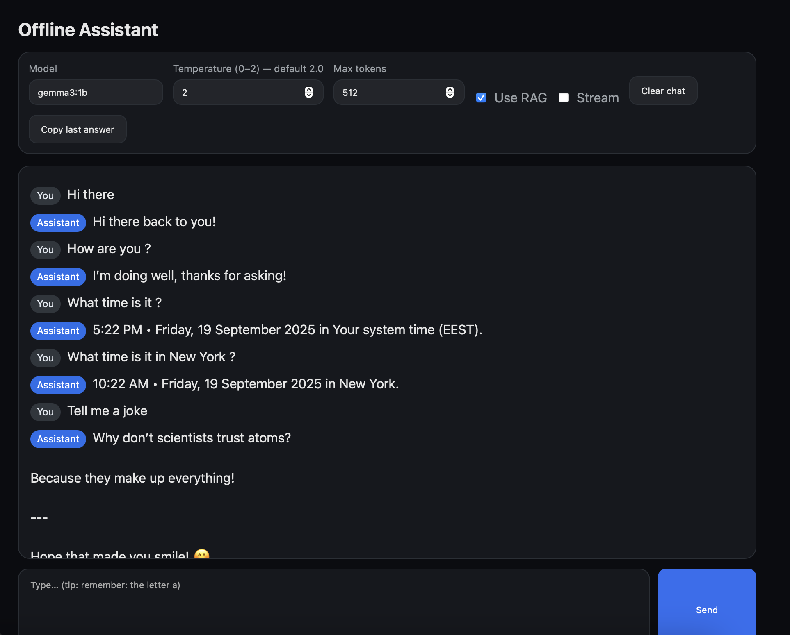

# 🧠 Offline AI Assistant

An **offline-first AI assistant** with chat UI, retrieval-augmented generation (RAG), and local memory.  
Built using **FastAPI** (backend), **LangChain + Ollama** (LLM integration), **ChromaDB** (vector database), and a lightweight **HTML/JS frontend**.

## ✨ Features
- 🗨️ Chat interface with adjustable parameters (temperature, max tokens, model)
- 📚 RAG integration — augment answers with your own documents
- 💾 Persistent memory across sessions (stored in SQLite via ChromaDB)
- 🔌 Runs completely **offline** (no external API calls required)
- 🌐 Web UI with local persistence (settings saved in browser)
- ⚡ Powered by **FastAPI + Uvicorn** for high-performance backend

## 🛠️ Tech Stack
- **Backend:** FastAPI, Uvicorn, Requests
- **LLM Orchestration:** LangChain, langchain-ollama
- **Vector Store:** ChromaDB
- **Embeddings:** Sentence-Transformers
- **Document ingestion:** PyPDF
- **Data validation:** Pydantic
- **Frontend:** Vanilla HTML + CSS + JS

## 📂 Project Structure
```
offline-assistant/
│── app/
│   ├── server.py         # FastAPI backend
│   ├── rag_index.py      # RAG pipeline + document indexing
│   └── chroma_db/        # Local ChromaDB storage (SQLite)
│── web/
│   └── index.html        # Chat UI
│── docs/                 # Example documents
│── requirements.txt
│── makefile              # Helper commands
│── run.sh                # Startup script
```

## 🚀 Getting Started

### 1. Clone & Install
```bash
git clone https://github.com/your-username/offline-assistant.git
cd offline-assistant

# Create and activate venv
python3 -m venv .venv
source .venv/bin/activate

# Install dependencies
pip install -r requirements.txt
```

### 2. Run Backend
```bash
uvicorn app.server:app --port 9000 --reload
```

### 3. Open Frontend
Simply open `web/index.html` in your browser.  
The UI will connect to the backend running at `http://localhost:9000`.

## 📸 Demo


## 🌍 Deployment Notes
- Local use works out of the box.  
- If you want others to try it online:
  - You must deploy the **FastAPI backend** (e.g., Render, Railway, Fly.io, VPS).
  - Then update `index.html` to point to your deployed backend URL instead of `http://localhost:9000`.  
- GitHub Pages can only host the static `index.html`, not the backend.

## 📜 License
MIT — free to use and modify.
